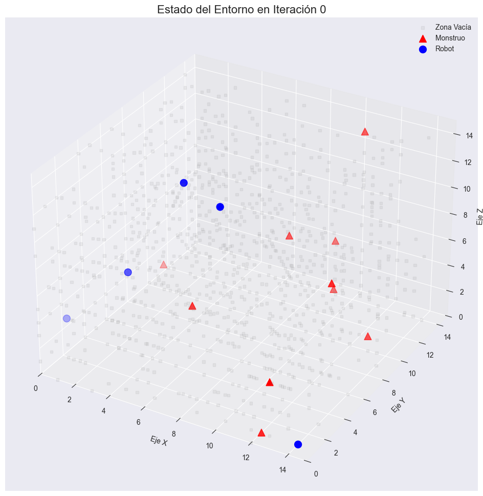
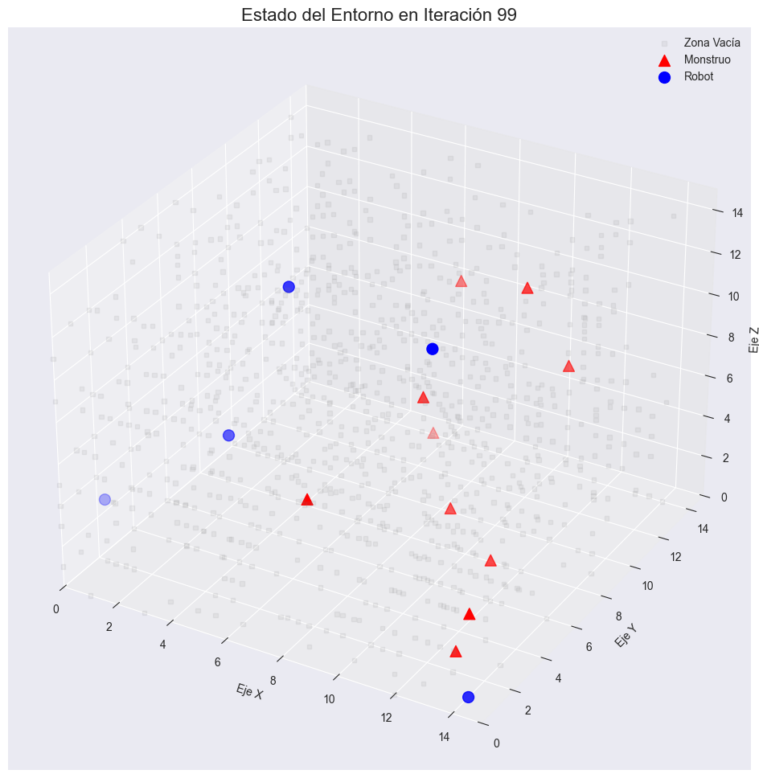
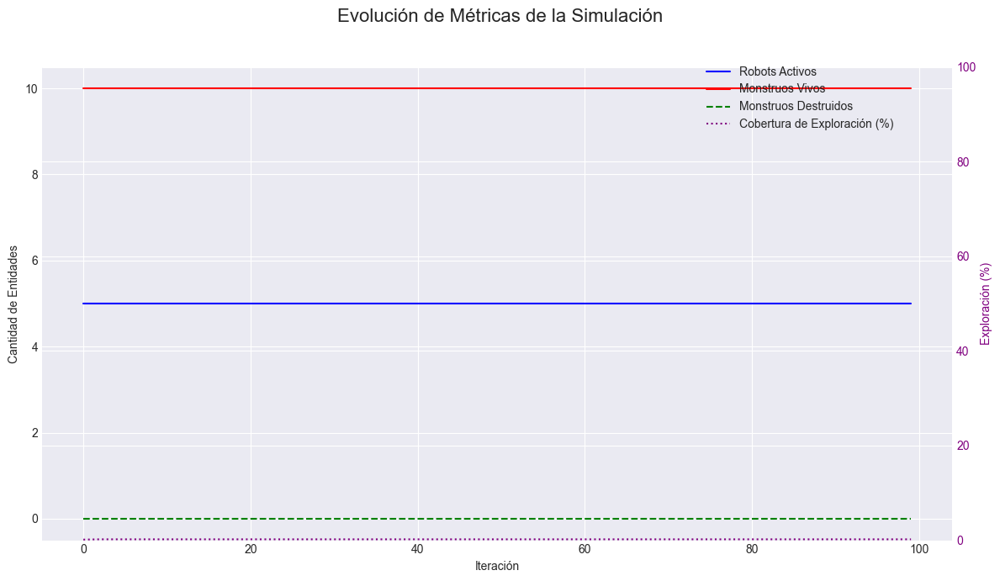
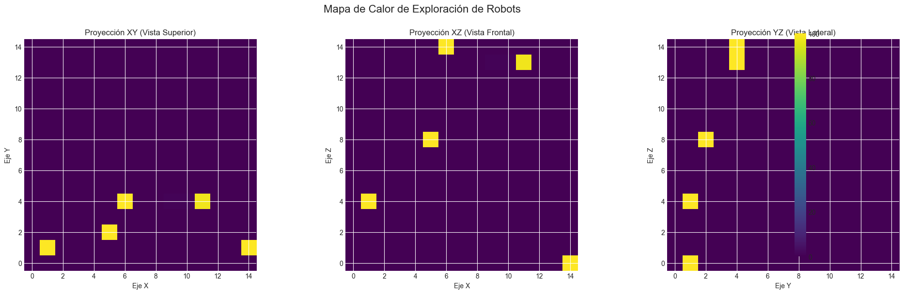
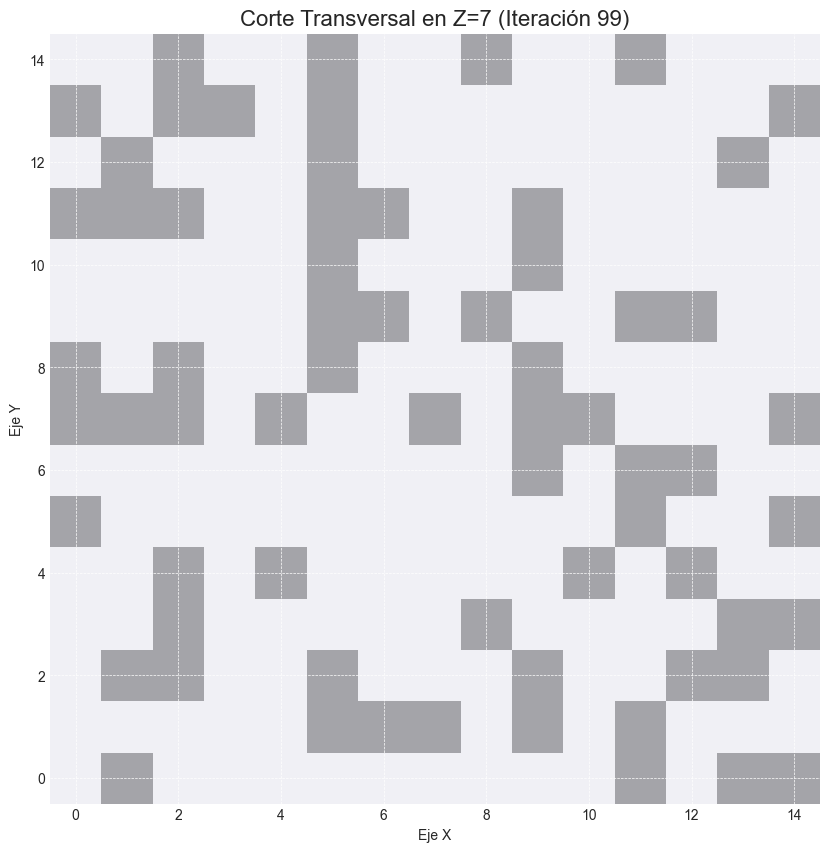

# Reporte de Simulación: Sistema Multi-Agente de Caza de Monstruos

**Fecha de generación:** 2025-10-18 23:42:43

---

## 1. Ontología del Sistema

### 1.1 Conceptos Fundamentales

#### Entorno de Operación
Espacio tridimensional discretizado en cubos de N³ celdas, donde cada celda puede ser:
- **Zona Libre**: Espacio navegable por entidades materiales y energéticas
- **Zona Vacía**: Espacio impenetrable que actúa como barrera física

#### Agente Robot
Entidad autónoma con capacidades sensoriales y efectoras diseñada para la caza de monstruos.
Características:
- Tiene **memoria interna** que almacena percepciones y acciones históricas
- Opera mediante un **ciclo percepción-decisión-acción**
- Puede **aprender de experiencias pasadas** para mejorar decisiones
- Se **autodestruye** al eliminar un monstruo

#### Agente Monstruo
Entidad energética que ocupa completamente un cubo del espacio.
Características:
- Agente de **reflejo simple** sin memoria
- Movimiento **estocástico** basado en probabilidad
- Irradia energía detectable en su entorno inmediato
- Desea ser destruido por los robots

#### Posición
Coordenada tridimensional (x, y, z) que identifica unívocamente una celda en el espacio.

#### Orientación
Vector direccional que define hacia dónde está orientado un robot (parte frontal).

#### Percepción
Información sensorial capturada por un agente en un momento específico.

#### Acción
Operación efectora ejecutada por un agente que modifica el entorno o su estado interno.

### 1.2 Relaciones Conceptuales

- Un **Agente** opera en un **Entorno**
- Un **Robot** tiene **Sensores** y **Efectores**
- Un **Robot** mantiene una **Tabla de Memoria** de percepciones-acciones
- Un **Monstruo** emite **Energía** detectable por sensores
- Una **Posición** puede contener una **Entidad** (Robot o Monstruo)
- Una **Zona Vacía** bloquea el movimiento de **Entidades**
- La **destrucción** de un monstruo elimina tanto al monstruo como al robot

---

## 2. Definición del Problema

### 2.1 Enunciado del Problema

Diseñar e implementar un sistema multi-agente donde robots autónomos con memoria interna
deben localizar y destruir monstruos en un entorno tridimensional parcialmente observable,
mientras evitan zonas vacías y coordinan acciones con otros robots.

### 2.2 Objetivos del Sistema

**Objetivo Principal:**
Maximizar la cantidad de monstruos destruidos minimizando el tiempo de búsqueda.

**Objetivos Secundarios:**
1. Explorar eficientemente el espacio 3D
2. Aprender patrones de ubicación de zonas vacías
3. Coordinar acciones entre múltiples robots
4. Utilizar memoria histórica para tomar decisiones informadas

### 2.3 Restricciones

- Los robots no conocen su posición absoluta en el espacio
- Los sensores tienen alcance limitado (entorno inmediato)
- Los monstruos pueden moverse estocásticamente
- La destrucción de un monstruo implica la pérdida del robot
- Las zonas vacías solo se detectan por colisión

---

## 3. Configuración de la Simulación

### 3.1 Parámetros del Entorno

- **Tamaño del espacio (N):** 15
- **Total de celdas:** 3375
- **Porcentaje de zonas libres:** 70.0%
- **Porcentaje de zonas vacías:** 30.0%

### 3.2 Parámetros de los Agentes

- **Número de robots:** 5
- **Número de monstruos:** 10
- **Frecuencia de movimiento de monstruos:** Cada 3 iteraciones
- **Probabilidad de movimiento de monstruos:** 100.0%

### 3.3 Parámetros de la Simulación

- **Máximo de iteraciones:** 100
- **Generación de imágenes:** Sí
- **Directorio de imágenes:** `reports\ejecucion_2025-10-18_23-42-38\images`
- **Semilla aleatoria:** 42

---

## 4. Descripción de los Agentes

### 4.1 Agente Robot (Con Memoria Interna)

#### 4.1.1 Sensores

1. **Giroscopio**
   - Proporciona orientación espacial del robot
   - Define parte frontal, posterior y 4 costados

2. **Monstroscopio**
   - Detecta presencia de monstruos en 5 celdas adyacentes (sin incluir parte posterior)
   - No indica dirección específica del monstruo

3. **Vacuscopio**
   - Se activa al colisionar con una Zona Vacía
   - La información se almacena en memoria para futuras decisiones

4. **Energómetro Espectral**
   - Detecta monstruos en la celda actual del robot
   - Activa el protocolo de destrucción

5. **Roboscanner**
   - Detecta otros robots en la celda frontal
   - Inicia protocolo de negociación para evitar colisiones

#### 4.1.2 Efectores

1. **Propulsor Direccional**
   - Mueve el robot una celda hacia adelante
   - Respeta orientación actual

2. **Reorientador**
   - Rota al robot 90° hacia uno de sus lados
   - Permite exploración omnidireccional

3. **Vacuumator**
   - Destruye monstruo y robot simultáneamente
   - Convierte la celda en Zona Vacía

#### 4.1.3 Memoria Interna

La memoria del robot almacena:
- Historial completo de percepciones y acciones
- Mapa de zonas vacías conocidas
- Posiciones donde se detectaron monstruos
- Estadísticas de éxito/fracaso de acciones
- Cobertura de exploración

#### 4.1.4 Reglas de Decisión

**Jerarquía de decisiones:**

1. **Prioridad Máxima:** Si hay monstruo en celda actual → Destruir
2. **Alta Prioridad:** Si hay robot adelante → Negociar movimiento
3. **Prioridad Media:** Si se detecta monstruo cercano → Moverse hacia él
4. **Prioridad Baja:** Explorar usando memoria histórica

**Reglas de exploración:**
- Evitar posiciones conocidas como zonas vacías
- Priorizar celdas no visitadas o poco visitadas
- Rotar si la celda frontal ha sido visitada múltiples veces

### 4.2 Agente Monstruo (Reflejo Simple)

#### 4.2.1 Percepciones

- Detección de celdas libres adyacentes (6 direcciones)
- No tiene modelo del entorno
- No almacena información histórica

#### 4.2.2 Acciones

1. **Moverse:** Selección aleatoria de celda libre adyacente
2. **Permanecer:** Cuando no puede moverse o no está en ciclo de movimiento

#### 4.2.3 Reglas

```
SI (iteración MOD frecuencia == 0) Y (random() < probabilidad) ENTONCES
    SI existen_celdas_libres_adyacentes ENTONCES
        mover_a_celda_aleatoria()
    FIN SI
FIN SI
```

---

## 5. Características del Ambiente (AIMA)

### 5.1 Para el Agente Robot

| Característica | Clasificación | Justificación |
|----------------|---------------|---------------|
| **Observabilidad** | Parcialmente observable | El robot solo percibe su entorno inmediato, no tiene visión global |
| **Determinismo** | Estocástico | Los monstruos se mueven aleatoriamente, afectando el estado |
| **Episódico** | Secuencial | Las decisiones actuales afectan estados futuros |
| **Dinamismo** | Dinámico | Los monstruos pueden moverse mientras el robot decide |
| **Discreto** | Discreto | Espacio, tiempo y acciones son discretos |
| **Agentes** | Multi-agente competitivo | Múltiples robots compiten por los mismos monstruos |

### 5.2 Para el Agente Monstruo

| Característica | Clasificación | Justificación |
|----------------|---------------|---------------|
| **Observabilidad** | Parcialmente observable | Solo percibe celdas adyacentes |
| **Determinismo** | Estocástico | Sus propias acciones son probabilísticas |
| **Episódico** | Episódico | Cada decisión de movimiento es independiente |
| **Dinamismo** | Dinámico | Los robots se mueven en el entorno |
| **Discreto** | Discreto | Todas las variables son discretas |
| **Agentes** | Multi-agente | Interactúa con múltiples robots |

---

## 6. Tablas Percepción-Acción

### 6.1 Tabla del Agente Robot

| Percepción | Acción | Parámetros |
|------------|--------|------------|
| Monstruo en celda actual | Activar Vacuumator | {} |
| Robot adelante | Negociar | {decisión: rotar/continuar} |
| Monstruo detectado nearby | Mover hacia monstruo | {razón: hunting} |
| Zona vacía conocida adelante | Rotar | {lado: n, razón: evitar_void} |
| Celda frontal no visitada | Mover | {razón: explorar} |
| Celda frontal muy visitada | Rotar | {lado: n, razón: ya_visitada} |
| Sin estímulos especiales | Mover (exploración) | {razón: exploración_default} |

### 6.2 Tabla del Agente Monstruo

| Percepción | Condición | Acción |
|------------|-----------|--------|
| Celdas libres disponibles | (iter % K == 0) AND (rand < p) | Mover aleatoriamente |
| Celdas libres disponibles | NOT (iter % K == 0) | Permanecer |
| Sin celdas libres | Siempre | Permanecer |

---

## 7. Resultados de la Simulación

### 7.1 Resumen Ejecutivo

- **Total de iteraciones ejecutadas:** 100
- **Robots iniciales:** 5
- **Robots finales (activos):** 5
- **Robots sacrificados:** 0
- **Monstruos iniciales:** 10
- **Monstruos finales:** 10
- **Monstruos destruidos:** 0
- **Movimientos totales:** 334
- **Exploración máxima alcanzada:** 0.21%

### 7.2 Métricas de Desempeño

- **Eficiencia de destrucción:** 0.00 monstruos por robot
- **Tasa de éxito:** 0.00% de monstruos eliminados
- **Tasa de sacrificio:** 0.00% de robots perdidos

---

## 8. Visualizaciones

### 8.1 Estado Inicial del Entorno



*Figura 1: Configuración inicial del entorno 3D con robots (azul) y monstruos (rojo)*

### 8.2 Estado Final del Entorno



*Figura 2: Configuración final después de la simulación*

### 8.3 Estadísticas de la Simulación



*Figura 3: Evolución de las métricas clave durante la simulación*

### 8.4 Mapa de Calor de Exploración



*Figura 4: Proyecciones del mapa de calor mostrando las áreas más exploradas*

### 8.5 Corte Transversal del Espacio



*Figura 5: Vista 2D de un corte horizontal del espacio en el nivel medio*

---

## 9. Análisis de Resultados

### 9.1 Comportamiento de los Robots

**Robots que completaron la simulación:** 5
**Robots destruidos (con monstruos):** 0

#### Estadísticas por Robot:

**Robot 1** (ID: `robot_0_`)
- Estado: Activo
- Movimientos realizados: 0
- Rotaciones realizadas: 0
- Colisiones con zonas vacías: 100
- Monstruos destruidos: 0

**Robot 2** (ID: `robot_1_`)
- Estado: Activo
- Movimientos realizados: 0
- Rotaciones realizadas: 0
- Colisiones con zonas vacías: 100
- Monstruos destruidos: 0

**Robot 3** (ID: `robot_2_`)
- Estado: Activo
- Movimientos realizados: 3
- Rotaciones realizadas: 0
- Colisiones con zonas vacías: 97
- Monstruos destruidos: 0

**Robot 4** (ID: `robot_3_`)
- Estado: Activo
- Movimientos realizados: 1
- Rotaciones realizadas: 0
- Colisiones con zonas vacías: 99
- Monstruos destruidos: 0

**Robot 5** (ID: `robot_4_`)
- Estado: Activo
- Movimientos realizados: 0
- Rotaciones realizadas: 0
- Colisiones con zonas vacías: 100
- Monstruos destruidos: 0

### 9.2 Comportamiento de los Monstruos

**Total de monstruos:** 10

- Movimientos totales de monstruos: 330
- Promedio de movimientos por monstruo: 33.00

---

## 10. Eventos Importantes

**Total de eventos registrados:** 0
**Eventos de destrucción:** 0


---

## 11. Conclusiones

### 11.1 Cumplimiento de Objetivos

El sistema logró destruir **0** de **10** monstruos (0.0% del total), 
sacrificando **0** de **5** robots (0.0%).

### 11.2 Efectividad del Agente con Memoria Interna

Los robots demostraron capacidad de:
1. **Aprendizaje:** Evitar zonas vacías previamente descubiertas
2. **Exploración inteligente:** Priorizar áreas no visitadas
3. **Coordinación:** Negociar cuando se encuentran con otros robots
4. **Cobertura:** Explorar hasta 0.21% del espacio disponible

### 11.3 Comportamiento Emergente

Se observaron los siguientes patrones emergentes:
- Los robots tienden a concentrarse en áreas con alta densidad de monstruos
- La memoria permite optimización de rutas evitando colisiones repetidas
- La estrategia de rotación incremental distribuye la exploración uniformemente

### 11.4 Limitaciones Identificadas

1. **Información imperfecta:** Los monstruos pueden moverse, invalidando creencias previas
2. **Coordinación limitada:** Los robots solo negocian en colisiones directas
3. **Sacrificio inevitable:** Cada destrucción implica pérdida del robot
4. **Alcance sensorial:** Detección de monstruos solo en entorno inmediato

### 11.5 Racionalidad del Agente Robot

**Medida de desempeño:** Maximizar monstruos destruidos / Minimizar iteraciones

- **Eficiencia:** 0.00 monstruos por robot
- **Iteraciones promedio por destrucción:** 100.00

El agente demuestra **racionalidad limitada** dado que:
- Toma decisiones óptimas con la información disponible
- Utiliza su memoria para mejorar decisiones futuras
- Opera bajo restricciones computacionales y sensoriales
- No puede anticipar movimientos estocásticos de monstruos

### 11.6 Ambiente Episódico vs Secuencial

El ambiente para el robot es **SECUENCIAL**, no episódico porque:
1. Las acciones actuales afectan estados futuros
2. La memoria histórica influye en decisiones
3. Las posiciones visitadas reducen opciones de exploración
4. El aprendizaje de zonas vacías es acumulativo

**¿Entra en bucle infinito?**

No, el agente está diseñado para evitar bucles mediante:
- Contador de visitas por posición
- Rotación cuando detecta repetición excesiva
- Exploración dirigida a zonas no visitadas
- Límite máximo de iteraciones de la simulación

### 11.7 Representación del Conocimiento

La tabla de mapeo percepción-acción permite:
- **Memoria episódica:** Registro completo de experiencias
- **Memoria semántica:** Abstracción de patrones (zonas vacías, monstruos)
- **Inferencia:** Decisiones basadas en conocimiento acumulado
- **Adaptación:** Ajuste de estrategia según historia

---

## 12. Bibliografía

1. Russell, S., & Norvig, P. (2020). *Artificial Intelligence: A Modern Approach* (4th ed.). Pearson.
2. Wooldridge, M. (2009). *An Introduction to MultiAgent Systems* (2nd ed.). Wiley.
3. Weiss, G. (Ed.). (2013). *Multiagent Systems* (2nd ed.). MIT Press.

---

**Reporte generado automáticamente el 2025-10-18 23:42:43**
